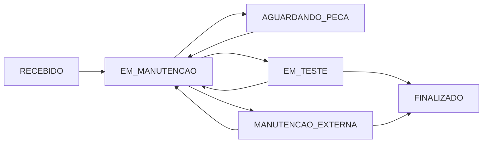
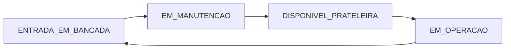
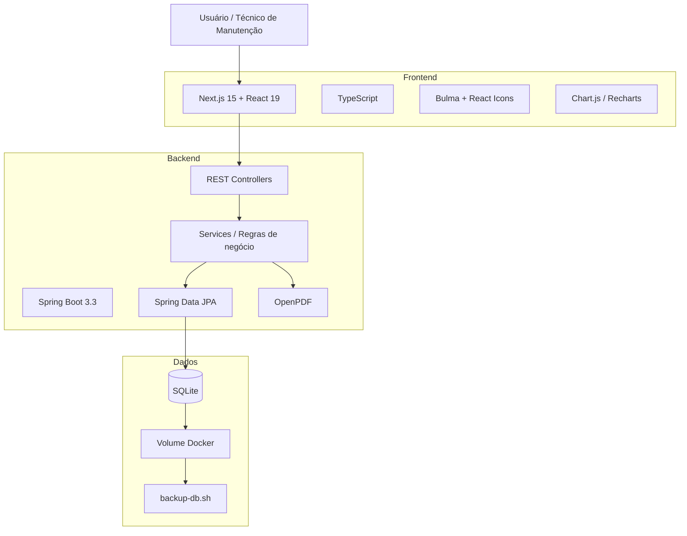
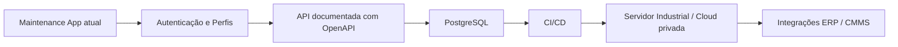

<div align="center">

# Maintenance App

### Gestão de Manutenção Elétrica Industrial

**Sistema full stack criado a partir de uma necessidade real de organização da rotina de manutenção industrial elétrica.**

<p>
  
  
  
  
  
  
  
  
</p>

**Equipamentos • Ordens de Serviço • Histórico Operacional • Estoque • Apontamentos • Relatórios**

</div>

---

## 📌 Sobre o projeto

O **Maintenance App** é uma aplicação web para apoiar a organização de uma bancada/setor de **manutenção elétrica industrial**.

O projeto nasceu de uma necessidade prática: centralizar informações que normalmente ficam espalhadas entre anotações, planilhas, mensagens e controles manuais. A proposta é manter em um único sistema o cadastro de equipamentos, o fluxo das ordens de serviço, o histórico de cada ativo, os apontamentos dos turnos e o estoque técnico utilizado pela manutenção.

Mais do que um projeto de estudo, esta aplicação representa a transformação de um problema observado no ambiente industrial em uma solução de software funcional e evolutiva.

> **Contexto real:** desenvolvido por um técnico de manutenção industrial elétrica para melhorar rastreabilidade, organização e consulta das atividades do próprio setor.

---

## 🎯 Problema que o sistema busca resolver

Em uma rotina de manutenção industrial, é comum haver dificuldade para responder rapidamente perguntas como:

- Qual equipamento está atualmente na bancada?
- Qual foi o defeito relatado quando ele chegou?
- Quem executou a última intervenção?
- Em qual etapa da manutenção a OS está?
- Quantas vezes o equipamento retornou para manutenção?
- Quanto tempo ele permaneceu em manutenção, operação ou prateleira?
- Quais serviços foram executados em determinado turno?
- Existem registros sem número de SM ou OS?
- Onde determinado componente está armazenado?
- Qual é a quantidade disponível desse item no estoque?

O Maintenance App concentra essas informações e cria um **histórico técnico consultável**, reduzindo dependência de controles paralelos.

---

## ✨ Principais funcionalidades

| Módulo | Recursos |
| --- | --- |
| ⚙️ **Equipamentos** | Cadastro, número de série, destino atual, status operacional, consulta detalhada e histórico |
| 🧰 **Gestão de Bancada** | Abertura e acompanhamento de ordens de serviço, status de manutenção, técnico responsável e histórico da OS |
| 📈 **Métricas do Equipamento** | Passagens pela bancada, ordens abertas, retornos para manutenção e tempos médios por estado operacional |
| 📝 **Apontamento Diário** | Organização por turma/turno, integrantes, SM, OS, ocorrência/trabalho realizado e edição de registros |
| 📅 **Consulta por Período** | Filtro de apontamentos e históricos por intervalo de datas |
| 🔎 **Auditoria de Apontamentos** | Filtros para localizar registros sem SM, sem OS ou por termo pesquisado |
| 📦 **Estoque Técnico** | Cadastro de componentes, localidade, prateleira, quantidade, entrada, saída, edição e exclusão |
| 📄 **Relatório em PDF** | Exportação dos apontamentos de turnos por período |
| 💾 **Persistência Local** | Banco SQLite mantido em volume persistente pelo Docker |
| 🗄️ **Backup** | Script para cópia periódica do banco e retenção configurável dos arquivos |

---

## 🔄 Fluxo de manutenção

As ordens de serviço utilizam estados que representam a evolução do equipamento dentro do processo de manutenção:



### Status de manutenção disponíveis

- `RECEBIDO`
- `AGUARDANDO_PECA`
- `EM_MANUTENCAO`
- `EM_TESTE`
- `MANUTENCAO_EXTERNA`
- `FINALIZADO`

Além do estado da OS, o sistema mantém um **status operacional do equipamento**, permitindo separar a condição física/operacional do ativo do andamento de uma ordem específica.



Status operacionais implementados:

- `ENTRADA_EM_BANCADA`
- `EM_MANUTENCAO`
- `DISPONIVEL_PRATELEIRA`
- `EM_OPERACAO`

---

## 🧠 Visão funcional

### 1. Gestão de equipamentos

Cada equipamento pode possuir:

- nome;
- número de série;
- destino atual;
- status operacional atual;
- data da última mudança operacional;
- histórico operacional;
- ordens de serviço associadas.

A tela detalhada do equipamento consolida informações do ativo e permite consultar seu comportamento ao longo do tempo.

### 2. Histórico operacional e métricas

O backend mantém eventos operacionais com informações como:

- status;
- data e hora do evento;
- técnico responsável;
- observação;
- destino;
- OS relacionada.

A resposta detalhada do equipamento também contempla métricas como:

- total de passagens pela bancada;
- total de ordens em aberto;
- total de eventos no histórico;
- total de mudanças operacionais;
- total de retornos para manutenção;
- tempo médio em prateleira;
- tempo médio em operação;
- tempo médio em manutenção.

### 3. Ordens de serviço

Uma OS armazena:

- número da OS;
- equipamento relacionado;
- origem/setor;
- defeito relatado;
- status atual;
- técnico atual;
- data de abertura;
- data de fechamento;
- histórico de intervenções.

Cada evento do histórico pode registrar técnico, observação, trabalho executado, status e data/hora.

### 4. Apontamento diário

Os apontamentos foram estruturados para representar a rotina real da equipe de manutenção.

Um turno possui:

- nome da turma;
- período (`MANHA`, `TARDE` ou `NOITE`);
- horário de início;
- data;
- integrantes;
- registros de trabalho.

Cada registro pode conter:

- número da SM;
- número da OS;
- descrição do trabalho/ocorrência;
- horário do registro.

A interface também permite localizar apontamentos **sem SM**, **sem OS** ou por texto, além de gerar um relatório em PDF por intervalo de datas.

### 5. Estoque técnico

O módulo de estoque mantém um controle simples e objetivo para componentes e insumos utilizados pela manutenção:

- nome do item;
- localidade;
- prateleira;
- quantidade;
- entrada de material;
- saída de material;
- filtros de pesquisa;
- edição e exclusão.

---

## 🏗️ Arquitetura



### Organização em camadas

O backend segue uma separação entre:

```text
Controller
   ↓
Service
   ↓
Mapper / DTO
   ↓
Repository
   ↓
Entity / SQLite
```

Essa divisão facilita a evolução do domínio e reduz o acoplamento entre a API, regras de negócio e persistência.

---

## 🛠️ Tecnologias utilizadas

### Frontend

- **Next.js 15.3**
- **React 19**
- **TypeScript 5**
- **Axios**
- **Bulma CSS**
- **React Hook Form**
- **Yup**
- **React Icons**
- **Chart.js**
- **React Chart.js 2**
- **Recharts**
- **date-fns**

### Backend

- **Java 17**
- **Spring Boot 3.3.1**
- **Spring Web**
- **Spring Data JPA**
- **Hibernate**
- **Hibernate Community Dialects**
- **Lombok**
- **OpenPDF**
- **Maven**

### Banco e infraestrutura

- **SQLite**
- **Docker**
- **Docker Compose**
- volume persistente para dados
- script Bash para backup

---

## 📁 Estrutura do repositório

```text
maintenance-app/
├── maintenance/                  # Frontend Next.js + React + TypeScript
│   ├── public/
│   ├── src/
│   │   ├── app/
│   │   │   ├── http/            # Cliente HTTP/Axios
│   │   │   ├── models/          # Interfaces e enums do domínio
│   │   │   └── services/        # Comunicação com a API
│   │   ├── components/
│   │   │   ├── EAUT/            # Módulos de manutenção
│   │   │   ├── common/          # Componentes reutilizáveis
│   │   │   └── layout/
│   │   ├── pages/               # Rotas do frontend
│   │   └── util/
│   ├── Dockerfile
│   └── package.json
│
├── manutecao-api/
│   ├── Dockerfile
│   └── barber/                   # Projeto Spring Boot/Maven
│       ├── src/main/java/
│       │   └── com/ajsolutions/barber/
│       │       ├── business/
│       │       │   ├── dtos/
│       │       │   ├── mappers/
│       │       │   └── services/
│       │       ├── controller/
│       │       └── infra/
│       │           ├── config/
│       │           ├── entities/
│       │           ├── enums/
│       │           ├── exceptions/
│       │           └── repository/
│       └── pom.xml
│
├── sqlite-data/                  # Volume local do SQLite (DB ignorado pelo Git)
├── backup/                       # Backups locais (arquivos ignorados pelo Git)
├── backup-db.sh                  # Rotina de backup do SQLite
├── docker-compose.yml
├── .env.example
├── .gitignore
└── README.md
```

---

## 🚀 Executando com Docker Compose

Esta é a forma recomendada para subir o projeto completo.

### Pré-requisitos

- Docker
- Docker Compose

### 1. Clone o repositório

```bash
git clone <URL-DO-SEU-REPOSITORIO>
cd maintenance-app
```

### 2. Configure o ambiente

```bash
cp .env.example .env
```

O valor padrão é:

```env
NEXT_PUBLIC_API_URL=http://localhost:8080
```

### 3. Suba os containers

```bash
docker compose up --build -d
```

### 4. Acesse

| Serviço | Endereço |
| --- | --- |
| Frontend | `http://localhost:3000` |
| API | `http://localhost:8080` |

### 5. Verifique os containers

```bash
docker compose ps
```

### 6. Acompanhe os logs

```bash
docker compose logs -f
```

### 7. Encerrar

```bash
docker compose down
```

> O banco permanece no diretório `sqlite-data/` através do volume configurado no Compose.

---

## 💻 Desenvolvimento local

### Frontend

Pré-requisitos:

- Node.js 20+
- Yarn

```bash
cd maintenance
cp .env.example .env.local
yarn install
yarn dev
```

Frontend disponível em:

```text
http://localhost:3000
```

### Backend

Pré-requisitos:

- Java 17
- Maven 3.9+

A partir da pasta `manutecao-api/barber`, configure uma conexão SQLite e execute:

```bash
./mvnw spring-boot:run
```

Para desenvolvimento, a alternativa mais simples é manter apenas o backend em Docker e executar o frontend localmente.

---

## 🔧 Variáveis de ambiente

### Frontend

| Variável | Finalidade | Padrão |
| --- | --- | --- |
| `NEXT_PUBLIC_API_URL` | URL pública da API utilizada pelo navegador | `http://localhost:8080` |

### Backend no Docker Compose

| Variável | Finalidade |
| --- | --- |
| `SPRING_DATASOURCE_URL` | Caminho JDBC do banco SQLite |
| `SPRING_DATASOURCE_DRIVER_CLASS_NAME` | Driver JDBC utilizado |
| `SPRING_JPA_HIBERNATE_DDL_AUTO` | Estratégia de atualização do schema |
| `JAVA_TOOL_OPTIONS` | Limites iniciais de memória da JVM |

---

## 🌐 API REST

Base local:

```text
http://localhost:8080
```

### Equipamentos

| Método | Endpoint | Descrição |
| --- | --- | --- |
| `POST` | `/api/equipments` | Cadastrar equipamento |
| `GET` | `/api/equipments` | Listar equipamentos |
| `GET` | `/api/equipments/{id}` | Buscar equipamento |
| `GET` | `/api/equipments/{id}/detalhe` | Buscar visão detalhada e métricas |
| `PUT` | `/api/equipments/atualizar/{id}` | Atualizar equipamento |
| `GET` | `/api/equipments/em-bancada` | Listar equipamentos atualmente em bancada |
| `PATCH` | `/api/equipments/status-operacional` | Registrar alteração operacional |

### Ordens de serviço

| Método | Endpoint | Descrição |
| --- | --- | --- |
| `POST` | `/api/work-orders` | Criar OS |
| `GET` | `/api/work-orders` | Listar todas as OS |
| `GET` | `/api/work-orders/{id}` | Buscar OS pelo ID |
| `GET` | `/api/work-orders/status/{status}` | Filtrar por status |
| `GET` | `/api/work-orders/{id}/ordens` | Consultar OS de um equipamento com filtros opcionais |
| `GET` | `/api/work-orders/{id}/historico-operacional` | Consultar histórico operacional do equipamento |
| `POST` | `/api/work-orders/{id}/history` | Adicionar evento ao histórico da OS |

### Estoque

| Método | Endpoint | Descrição |
| --- | --- | --- |
| `POST` | `/api/estoque` | Cadastrar item |
| `GET` | `/api/estoque` | Listar/pesquisar itens |
| `GET` | `/api/estoque/{id}` | Buscar item |
| `PUT` | `/api/estoque/{id}` | Atualizar item |
| `DELETE` | `/api/estoque/{id}` | Excluir item |
| `PATCH` | `/api/estoque/{id}/entrada` | Registrar entrada |
| `PATCH` | `/api/estoque/{id}/saida` | Registrar saída |

Filtros aceitos em `GET /api/estoque`:

```text
?nome=...
?localidade=...
?prateleira=...
```

### Apontamentos

| Método | Endpoint | Descrição |
| --- | --- | --- |
| `GET` | `/api/apontamentos?data=AAAA-MM-DD` | Buscar turnos de uma data |
| `GET` | `/api/apontamentos/porperiodo` | Buscar turnos em um período |
| `POST` | `/api/apontamentos/turno` | Iniciar turno |
| `PUT` | `/api/apontamentos/turno/{id}` | Editar turno |
| `POST` | `/api/apontamentos/turno/{turnoId}/trabalho` | Registrar trabalho |
| `PUT` | `/api/apontamentos/turno/{turnoId}/trabalho/{apontamentoId}` | Editar trabalho |
| `GET` | `/api/apontamentos/turnos/pdf` | Gerar relatório PDF por período |

Exemplo de relatório:

```text
GET /api/apontamentos/turnos/pdf?dataInicio=2026-08-01&dataFim=2026-08-07
```

---

## 💾 Banco de dados

O projeto utiliza **SQLite**, uma escolha adequada para o cenário atual por oferecer:

- implantação simples;
- baixa sobrecarga operacional;
- persistência em arquivo;
- facilidade de backup;
- ausência de necessidade de um servidor de banco separado.

No Docker, o arquivo é persistido em:

```text
./sqlite-data/banco_manutencao.db
```

> O arquivo do banco é ignorado pelo Git. Dados operacionais não devem ser enviados ao repositório.

---

## 🗄️ Backup do banco

O script `backup-db.sh` cria uma cópia timestampada do banco SQLite.

```bash
./backup-db.sh
```

Exemplo de saída:

```text
backup/banco_manutencao-2026-08-07-003000.db
```

Por padrão, backups com mais de **7 dias** são removidos. A retenção pode ser alterada:

```bash
BACKUP_RETENTION_DAYS=30 ./backup-db.sh
```

Para automatizar em Linux, o script pode ser associado ao `cron` ou a um timer do `systemd`.

---

## 🔐 Cuidados antes de publicar no GitHub

Este repositório foi preparado para **não versionar dados operacionais locais**.

Nunca publique:

- arquivos `.env` reais;
- bancos SQLite de produção;
- backups do banco;
- chaves ou certificados;
- dados de equipamentos que sejam confidenciais;
- nomes de colaboradores, históricos ou registros internos sem autorização;
- informações que possam revelar detalhes sensíveis da planta industrial.

Os seguintes padrões já estão cobertos pelo `.gitignore` da versão preparada:

```text
.env
*.db
backup/*.db
target/
.next/
node_modules/
.idea/
```

---

## 🧪 Qualidade e evolução técnica

O projeto está funcional e em evolução. Para transformá-lo em uma solução ainda mais robusta para ambientes industriais, os próximos passos técnicos recomendados incluem:

- testes unitários e de integração no backend;
- testes de componentes e fluxos no frontend;
- documentação OpenAPI/Swagger;
- validação centralizada de DTOs;
- tratamento global de exceções da API;
- autenticação;
- controle de acesso por perfil;
- trilha de auditoria;
- CI com GitHub Actions;
- análise estática e padronização de código;
- migrations versionadas para o banco;
- padronização completa da nomenclatura interna dos módulos.

---

## 🗺️ Roadmap

### Curto prazo

- [ ] Swagger / OpenAPI
- [ ] autenticação de usuários
- [ ] perfis de acesso (`técnico`, `líder`, `administrador`)
- [ ] testes automatizados
- [ ] pipeline CI no GitHub Actions
- [ ] indicadores visuais da bancada
- [ ] melhoria da responsividade para tablets industriais

### Médio prazo

- [ ] vincular peças consumidas diretamente às ordens de serviço
- [ ] histórico de movimentação de estoque
- [ ] alerta de estoque mínimo
- [ ] anexos/fotos em ordens de serviço
- [ ] QR Code por equipamento
- [ ] busca rápida pelo número de série
- [ ] indicadores MTTR e reincidência de falhas
- [ ] dashboard de equipamentos críticos
- [ ] programação de manutenção preventiva

### Longo prazo

- [ ] notificações automáticas
- [ ] PWA para uso em dispositivos móveis
- [ ] modo offline com sincronização
- [ ] integração com sistemas corporativos/ERP/CMMS
- [ ] PostgreSQL para ambientes multiusuário de maior escala
- [ ] implantação centralizada em servidor da empresa

---

## 📊 Indicadores que o projeto pode evoluir para acompanhar

Com os dados que já estão sendo armazenados, a aplicação pode crescer para calcular indicadores de manutenção como:

- quantidade de equipamentos em bancada;
- quantidade de OS em aberto;
- tempo médio de permanência na manutenção;
- quantidade de retornos por equipamento;
- reincidência de falhas;
- equipamentos com maior número de intervenções;
- consumo de componentes por período;
- itens abaixo do estoque mínimo;
- volume de apontamentos por turno;
- atividades sem SM ou OS associada;
- tempo médio entre entrada, manutenção, teste e retorno à operação.

---

## 💡 Decisões de projeto

### Por que uma aplicação web?

Uma interface web permite acesso por diferentes computadores e tablets da rede sem exigir instalação específica em cada estação.

### Por que separar frontend e backend?

A separação permite evoluir a interface e a API de forma independente e facilita futuras integrações com outros sistemas.

### Por que SQLite nesta fase?

Para um projeto inicialmente aplicado a um setor específico, SQLite reduz complexidade de infraestrutura sem abrir mão de persistência estruturada.

### Por que Docker?

Docker reduz diferenças entre máquinas, facilita a implantação e torna o ambiente mais reproduzível.

---

## 🧭 Possível evolução de arquitetura



---

## 🤝 Contribuição

Sugestões, issues e pull requests podem ser utilizados para documentar melhorias e evolução do sistema.

Fluxo sugerido:

```bash
git checkout -b feature/minha-melhoria
git commit -m "feat: descreve a melhoria"
git push origin feature/minha-melhoria
```

Depois, abra um Pull Request descrevendo o problema resolvido e o impacto da alteração.

---

## 📝 Convenção de commits sugerida

O projeto pode utilizar **Conventional Commits**:

```text
feat: nova funcionalidade
fix: correção de erro
refactor: melhoria interna sem alterar comportamento
style: ajustes visuais ou formatação
chore: tarefas de manutenção do projeto
docs: documentação
test: testes
```

Exemplos:

```text
feat: adiciona filtro de equipamentos por status
fix: corrige saída de estoque com quantidade inválida
docs: documenta execução com docker compose
```

---

## 📜 Licença

Este projeto **ainda não possui um arquivo `LICENSE` definido**.

Antes de disponibilizá-lo publicamente para uso ou distribuição por terceiros, escolha uma licença compatível com o objetivo do projeto, como MIT, Apache-2.0 ou outra política definida pelo responsável.

---

## 👷 Origem do projeto

Este software foi criado a partir da experiência prática em **manutenção elétrica industrial**, com foco em resolver dificuldades reais de organização da bancada, rastreabilidade de equipamentos, acompanhamento de serviços, registros de turno e controle de componentes.

O objetivo central é simples:

> **transformar a rotina técnica da manutenção em informação organizada, consultável e útil para tomada de decisão.**

---

<div align="center">

### ⚡ Maintenance App

**Tecnologia aplicada à organização da manutenção industrial.**

</div>
